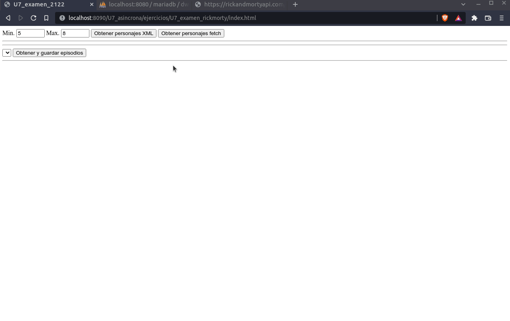

# Ejercicio 1

Deseamos elaborar una web para visualizar la relación de los episodios, personajes y localizaciones de la serie Rick and Morty, así como guardar un conjunto de episodios en una BBDD.

La web tendrá dos formularios.

- El primero de ellos contará con dos _inputs_ de tipo entero, que marcarán un rango de los **Personajes** (**Characters**) que se quieren obtener y un botón `Cargar personajes XML` y otro botón `Cargar personajes fetch`. Los botones harán exactamente lo mismo, pero uno hará la petición mediante el objeto `XMLHtttpRequest` y otro mediante la API `fetch`. Para obtener la información de un único personaje, se debe hacer una petición de tipo `GET`, sobre la url `https://rickandmortyapi.com/api/character/<NUMERO>`, sustituyendo `<NUMERO>`, por el número del personaje. Así que si el usuario ha elegido un rango de personajes del 5 al 8, se deberán hacer las peticiones siguientes:

  - https://rickandmortyapi.com/api/character/5
  - https://rickandmortyapi.com/api/character/6
  - https://rickandmortyapi.com/api/character/7
  - https://rickandmortyapi.com/api/character/8

Cada una de esas peticiones, devolverá una estructura tal que así:

```json
{
  "id": 2,
  "name": "Morty Smith",
  "status": "Alive",
  "species": "Human",
  "type": "",
  "gender": "Male",
  "origin": {
    "name": "Earth",
    "url": "https://rickandmortyapi.com/api/location/1"
  },
  "location": {
    "name": "Earth",
    "url": "https://rickandmortyapi.com/api/location/20"
  },
  "image": "https://rickandmortyapi.com/api/character/avatar/2.jpeg",
  "episode": [
    "https://rickandmortyapi.com/api/episode/1",
    "https://rickandmortyapi.com/api/episode/2"
    // ...
  ],
  "url": "https://rickandmortyapi.com/api/character/2",
  "created": "2017-11-04T18:50:21.651Z"
}
```

**IMPORTANTE**: Se aconseja guardar en un array cada una de las peticiones que se realizan para tener a disposición de todas las funciones los datos de los personajes.

Una vez se han hecho todas las peticiones, se deberá construir una pequeña ficha (no es importante la maquetación), una debajo de otra, para cada uno de los personajes pedidos, donde se muestre el nombre (**name**), la especie a la que pertenece (**species**), la localización (**location.name**), la foto (**image**) y la fecha de creación (**created**).

- El segundo formulario contendrá un seleccionable con tantas opciones como personajes haya elegido previamente el usuario, con el `id` del personaje como valor y el `name` del personaje para mostrar como texto del seleccionable. Contendrá un botón `Obtener y guardar episodios` que hará una petición `GET` a la url de cada uno de los episodios en los que ha participado. Una vez llegue cada una de las peticiones a los episodios, se hará una petición `POST` mediante `fetch` a la url `guardar_episodio_rm.php` con la cabecera header `Content-type` a `application/json`. Por ejemplo, si el usuario ha elegido el rango anterior de 5 a 8, y en el seleccionable elige el personaje con el `id=7` (**Abradolf Lincler**), este ha participado en dos episodios, por lo que habrá dos peticiones `GET` a las url de los episodios, y por cada una de ellas, una petición `POST` con el resultado de la petición `GET` anterior. El fichero `guardar_episodio_rm.php` devolverá un `JSON` con la siguiente estructura:

  ```json
  {
    "resultado": "Episodio YYYYY insertado correctamente"
  }
  ```

Cualquier otra respuesta se considerará un error.

- Debe mostrarse un texto informativo en un contenedor `div` con el id `resultados` a cada paso de la aplicación. Deberá ser ACUMULATIVO, para que no se pierdan los mensajes:

  - Personaje XXXXX cargado
  - Episodio YYYYY cargado
  - Episodio YYYYY insertado correctamente <-- este mensaje en concreto será el que devuelva la url `guardar_episodio_rm.php`, tal y como se muestra en la estructura de arriba.

Se adjunta una demo animada de la web:



## <ins>Instrucciones para la Entrega</ins>

- Entregar ÚNICA Y EXCLUSIVAMENTE los ficheros necesarios. Serán ficheros sueltos, correspondientes a los ejercicios (EjX.html EjX.js siendo X el número del ejercicio).

- Evita ñ y acentos en los nombres.

- **Deberán subirse a GitHub** los ficheros en la carpeta correspondiente (examen_U6U7) que se encontrará dentro de la carpeta U7.
